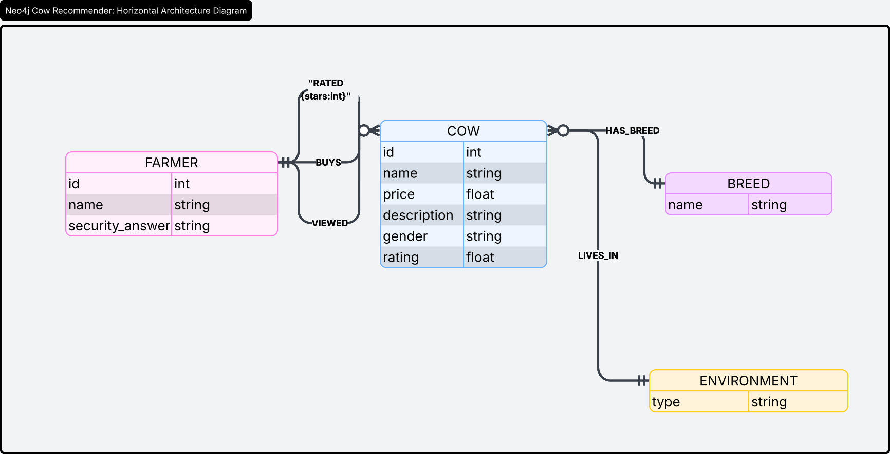
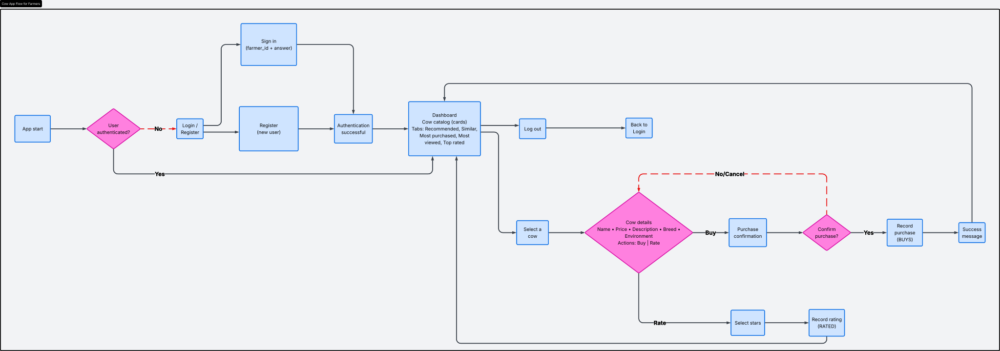
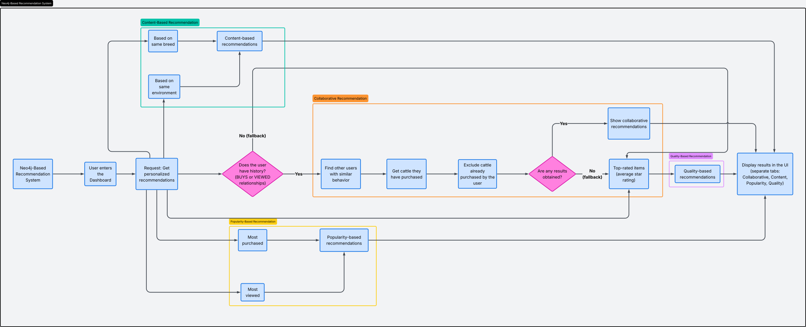

# 🐄 Cattle Recommender System - Proyecto AED

[🇺🇸 View English Version](README_EN.md)

Sistema inteligente de recomendación de ganado basado en grafos (Neo4j) y Python. Diseñado para optimizar la toma de decisiones de granjeros mediante algoritmos colaborativos y basados en contenido.

---

## 🚀 Stack Tecnológico
*   **Database:** Neo4j (Graph Database)
*   **Backend:** Python 3.x
*   **Containerization:** Docker
*   **Logic:** Cypher Query Language

## 📐 Arquitectura y Flujos
Visualización detallada de la estructura de datos y la experiencia de usuario.

### 1. Modelo de Grafo
Definición de nodos y relaciones en Neo4j.


### 2. Flujo de Usuario (Farmer Journey)
Camino que sigue el granjero desde el Login hasta la recepción de recomendaciones.


### 3. Lógica de Recomendación (Cerebro)
Algoritmos aplicados para generar las listas de cada pestaña.


---

## 🛠️ Configuración del Entorno

### 1. Base de Datos (Docker)
Para levantar el entorno local de Neo4j:
```powershell
docker run --name neo4j-cattle -p 7474:7474 -p 7687:7687 -d -e NEO4J_AUTH=neo4j/password neo4j:latest
```

### 2. Inicialización del Esquema
Es necesario configurar las restricciones de unicidad e índices antes de la carga de datos:
```powershell
python3 -m pip install neo4j
python3 test_db.py
```

---

## 📚 Documentación
*Manuales completos disponibles en el directorio `/docs`:*

| Documento | Idioma | Enlace |
| :--- | :--- | :--- |
| **Guía de Usuario** | 🇪🇸 Español | [Ver aquí](docs/Guia_Usuario_ES.md) |
| **User Guide** | 🇬🇧 English | [See here](docs/User_Guide_EN.md) |
| **Guía del Desarrollador** | 🇪🇸 Español | [Ver aquí](docs/Guia_Desarrollador_ES.md) |
| **Developer Guide** | 🇬🇧 English | [See here](docs/Developer_Guide_EN.md) |
| **Arquitectura** | 🇪🇸 Español | [Ver aquí](docs/Arquitectura_Sistema_ES.md) |
| **Architecture** | 🇬🇧 English | [See here](docs/System_Architecture_EN.md) |

---

## 👥 Equipo
*   **Alejandro:** Modelo de Grafo y Lógica de Recomendación.
*   **Samuel:** Infraestructura Backend y Conexión.
*   **Sara:** Generación de Datasets y Coherencia de Datos.
